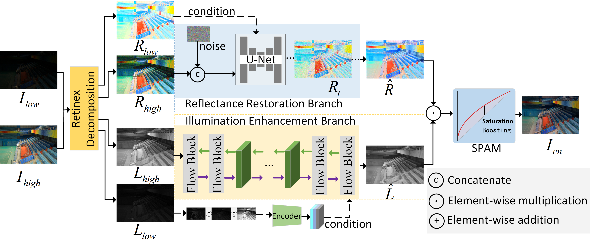
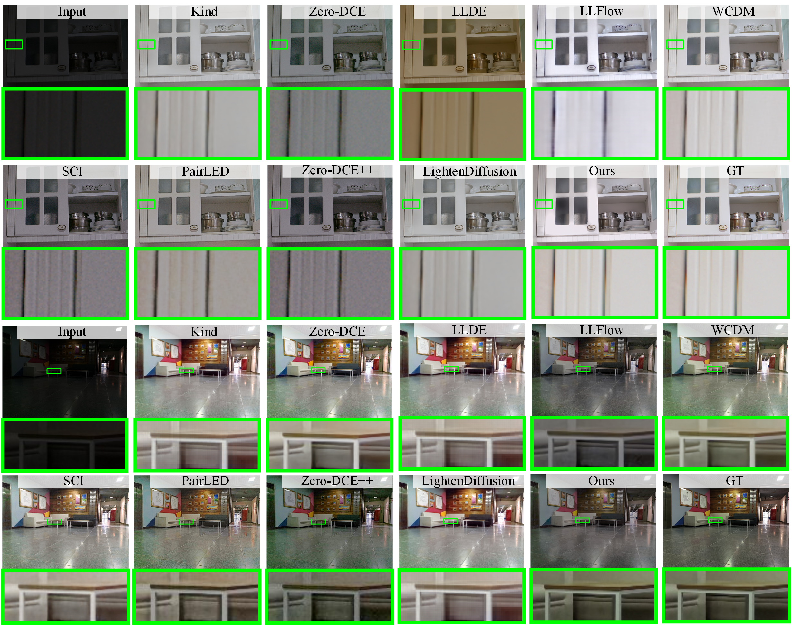
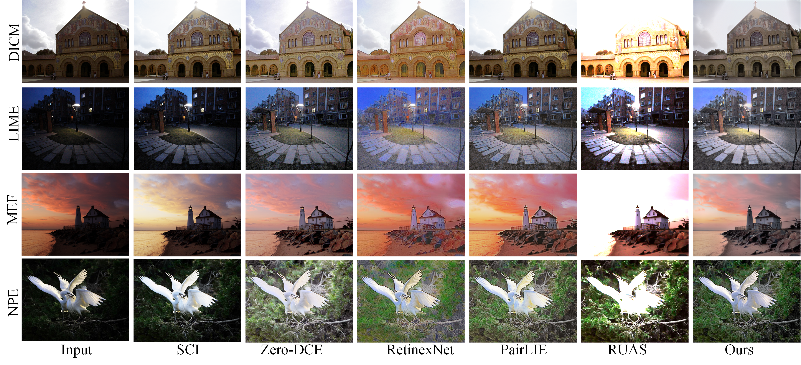
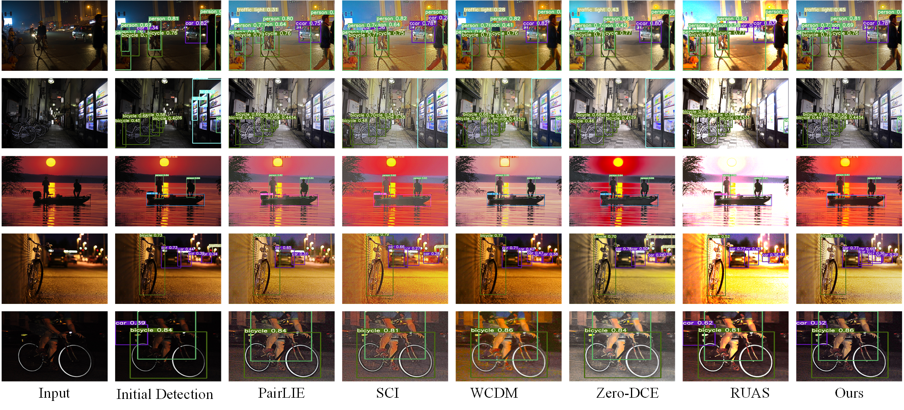
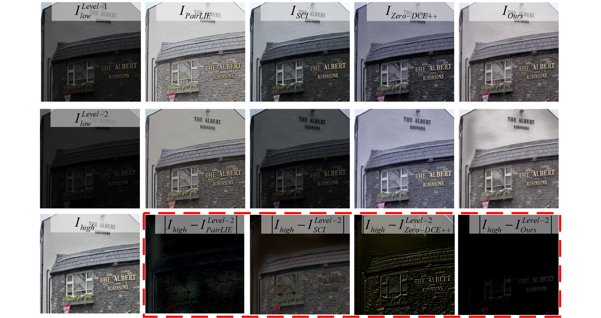
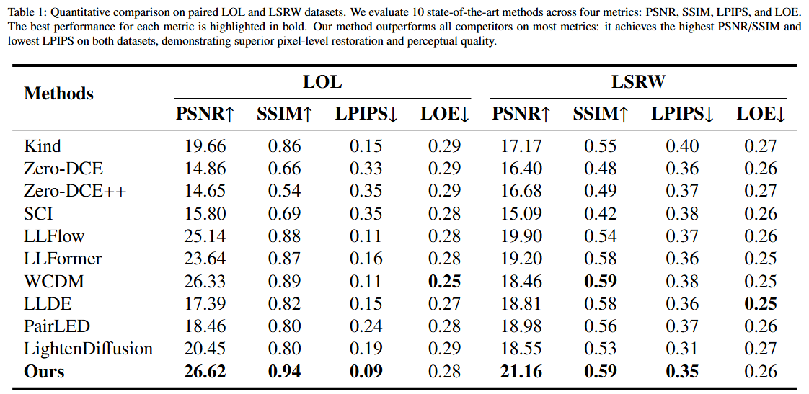
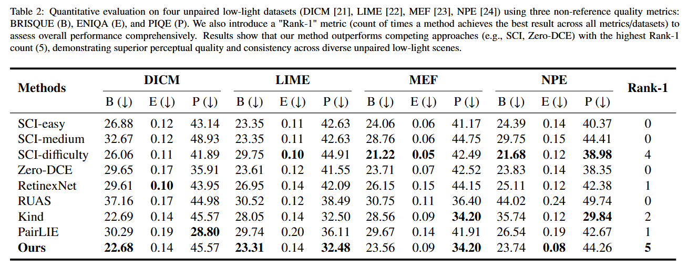

# Low Light Image Enhancement via Retinex Decomposition

​		Balancing illumination enhancement and noise suppression represents a fundamental challenge in low-light image enhancement (LLIE). Existing methods often suffer from artifacts induced during brightness adjustment, including detail loss, spatially varying illumination, and color distortion. Diverging from conventional single-path diffusion-based LLIE approaches, this paper proposes a novel dual-branch framework. It consists of a normalizing flow branch, a diffusion branch, and a saturation post-adjustment module. These components are designed to enhance illumination, recover details, and optimize saturation, respectively. Following Retinex decomposition, the illumination component is enhanced via an invertible mapping of the normalizing flow, offering a more deterministic transformation with fewer artifacts. Concurrently, the diffusion branch recovers reflectance details while effectively suppressing severe noise inherent in dark regions. Then, a saturation post-adjustment module compensates for saturation degradation arising from the multiplicative recombination of illumination and reflectance. Most importantly, the proposed framework achieves an optimal trade-off between illumination enhancement and detail preservation. Extensive experiments demonstrate that the proposed method achieves better performance against state-of-the-art approaches across multiple metrics. Furthermore, the results verify the practical utility of our approach by showing a measurable improvement in detection accuracy for downstream object detection tasks.

## Model Architecture



The proposed method follows a three-stage pipeline:

1. **Retinex Decomposition**: Decomposes low light images into Reflectance (R) and Illumination (L) components
2. **Component Enhancement**:
   - R component: Enhanced using diffusion models
   - L component: Enhanced using normalizing flows
3. **Fusion & Post-processing**: Combines enhanced components ($R_{enhanced} \times L_{enhanced}$) and applies SPAM for final refinement

## Installation

```bash
pip install -r requirements.txt
```

## Usage

### Testing

```bash
python test.py --input <path_to_image_or_folder> --output <output_folder>
```

Example:
```bash
python test.py --input ./data/test --output ./results
```

### Training

```bash
python train.py
```

Make sure to organize your training data as:
```
data/
├── train/
│   ├── low/    # low light images
│   └── high/   # ground truth images
└── test/
    └── low/    # test images
```

## Results

### Visual Comparison  










### Quantitative Comparison





